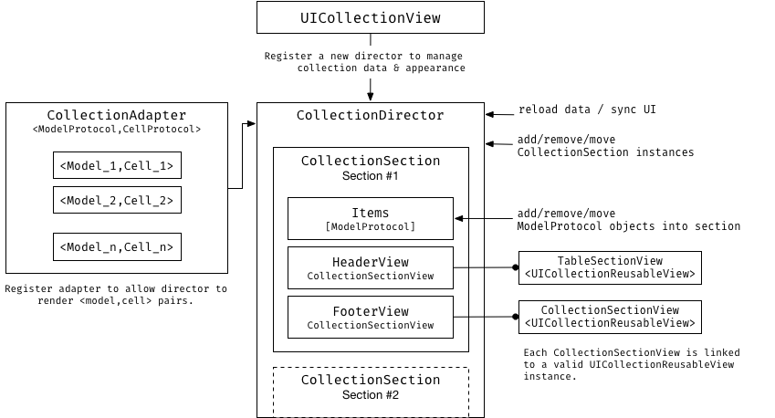

<p align="center" >

</p>

[](http://cocoadocs.org/docsets/FlowKitManager) [](http://cocoadocs.org/docsets/FlowKitManager) [](http://cocoadocs.org/docsets/FlowKitManager)
[](https://img.shields.io/cocoapods/v/FlowKitManager.svg)
[](https://github.com/Carthage/Carthage)
[](http://twitter.com/danielemargutti)

<p align="center" >★★ <b>Star me to follow the project! </b> ★★<br>
Created by <b>Daniele Margutti</b> - <a href="http://www.danielemargutti.com">danielemargutti.com</a>
</p>

## What's FlowKit
FlowKit is a new approach to create, populate and manage `UITableView` and `UICollectionView`.

With a declarative and type-safe approach you **don't need to implement datasource/delegate** anymore: your code is easy to read, maintain and [SOLID](https://en.wikipedia.org/wiki/SOLID_(object-oriented_design)).

Want to know more about FlowKit?

**I've made an introductory article: [click here to read it now!](http://danielemargutti.com/2018/04/23/tables-collections-with-declarative-approach/)**

## Features Highlights

- **No more datasource/delegate**: you don't need to implements tons of methods just to render your data. Just plain understandable methods to manage what kind of data you want to display, remove or move.
- **Type-safe**: register pair of model/cell types you want to render, then access to instances of them in pure Swift type-safe style.
-  **Auto-Layout**: self-sized cells are easy to be configured, both for tables and collection views.
-  **Built-In Auto Animations**: changes & sync between your datasource and table/collection is evaluated automatically and you can get animations for free.
-  **Compact Code**: your code for table and collection is easy to read & maintain; changes in datasource are done declaratively via `add`/`move` and `remove` functions (both for sections, header/footers and single rows). 


## What you will get
The following code is just a small example which shows how to make a simple Contacts list UITableView using FlowKit (it works similar with collection too):

```swift
// Create a director which manage the table/collection
let director = TableDirector(self.tableView)

// Declare an adapter which renders Contact Model using ContactCell
let cAdapter = TableAdapter<Contact,ContactCell>()

// Hook events you need
// ...dequeue
cAdapter.on.dequeue = { ctx in
	self.fullNameLabel.text = "\(ctx.model.firstName) \(ctx.model.lastName)"
	self.imageView.image = loadFromURL(ctx.model.avatarURL)
}
// ...tap (or all the other events you typically have for tables/collections)
cAdapter.on.tap = { ctx in
	openDetail(forContact: ctx.model)
}

// Register adapter; now the director know how to render your data
director.register(adapter: cAdapter)

// Manage your source by adding/removing/moving sections & rows
director.add(models: arrayOfContacts)
// Finally reload your table
director.reloadData()
```

Pretty simple uh?

No datasource, no delegate, just a declarative syntax to create & manage your data easily and in type-safe manner (both for models and cells).
Learn more about sections, header/footer & events by reading the rest of guide.


## Table Of Contents

- [Installation](#installation)
- [Documentation](#documentation)
- [Requirements](#requirements)

<a name="documentation"/>

## Documentation

The following guide explain how to use features available in FlowKit with a real example.
If you want to see a live example open `FlowKit.xcodeproj` and run the `Example` app.

- [Overview](#overview)
- [Create the Director](#createdirector)
- [Register Adapters](#registeradapters)
- [Create Data Models](#createdatamodels)
- [Create Cells](#createcells)
- [Add Sections](#addsections)
- [Manage Models/Items in Section](#managemodels)
- [Setup Headers & Footers](#setupheadersfooters)
- [Reload Data with/out Animations](#reloaddata)
- [Listen for Events](#events)
- [Sizing Cells](#sizingcells)

**Note**: *The following concepts are valid even if work with tables or collections using FlowKit (each class used starts with `Table[...]` or `Collection[...]` prefixes and where there are similaties between functions the name of functions/properties are consistence).*

### Overview

The following graph describe the infrastructure of FlowKit for Collection (the same graph is [also available for Tables](Documentation/Structure_TableKit.png))).



The most important class of FlowKit is the Director; this class (`TableDirector` for tables, `CollectionDirector`/`FlowCollectionDirector` for collections) manage the sync between the data and the UI: you can add/remove/move sections and configure the appearance and the behaviour of the list directly from this instance.
The first step to use FlowKit is to assign a director to your list: you can do it by calling `list.director` or just creating your own director with the list instance to manage:

```swift
let director = FlowCollectionDirector(self.collectionView)
```

In order to render some data FlowKit must know what kind of data you want to show into the list; data is organized as pair of `<Model,View>` (where `Model` is the object you want to add into the table and view is the cell used to represent the data).
**A `Model` must be an object (both class or struct) conform to `ModelProtocol`: this is a simple protocol which require the presence of a property `modelID`.
This property is used to uniquely identify the model and evaluate the difference between items during automatic reload with animations.**

Adapter also allows to receive events used to configure the view and the behaviour: you can intercept tap for an instance of your model and do something, or just fillup received type-safe cell instance with model instance.

So, as second step, you need to register some adapters:

```swift
let adapter = CollectionAdapter<Contact,ContactCell>()
adapter.on.tap = { ctx in
	print("User tapped on \(ctx.model.firstName)")
}
adapter.on.dequeue = { ctx in
	ctx.cell?.titleLabel?.text = ctx.model.firstName
}
```

Now you are ready to create sections with your models inside:

```swift
let section = TableSection(headerTitle: "Contacts", models: contactsList)
self.tableView.director.add(section: section)
```

Models array can be etherogenous, just remeber to make your objects conform to `ModelProtocol` and `Hashable` protocol and register the associated adapter. FlowKit will take care to call your adapter events as it needs.

Finally you can reload the data:

```swift
self.tableView.reloadData()
```

Et voilà! In just few lines of code you have created e managed even complex lists.

The following guide describe all the other features of the library.


<a name="createdirector"/>

### Create the Director (`TableDirector`/`CollectionDirector`)

You can think about the Director has the owner/manager of the table/collection: using it you can declare what kind of data your scroller is able to show (both models and views/cells), add/remove/move both sections and items in sections.
Since you will start using FlowKit you will use the director instance to manage the content of the UI.

*Keep in mind: a single director instance is able to manage only a single instance of a scroller.*

You have two ways to set a director; explicitly:

```swift
public class ViewController: UIViewController {
	@IBOutlet public var tableView: UITableView?
	private var director: TableDirector?
	
	override func viewDidLoad() {
		super.viewDidLoad()
		self.director = TableDirector(self.tableView!)	
	}
}
```

or using implicitly, by accessing to the `director` property: the first time you call it a new director instance is created and assigned with strong reference to the table/collection instance.

**Note:** For UICollectionView `FlowCollectionDirector` is created automatically; if you use another layout you must create a new one manually.

```swift
let director = self.tableView.director // create a director automatically and assign as strong reference to the table/collection
// do something with it...
```

<a name="registeradapters"/>

### Register Adapters (`TableAdapter`/`CollectionAdapter`)

Once you have a director you need to tell to it what kind of data you are about to render: you can have an etherogeneus collection of Models and View (cells) in your scroller but a single Model can be rendered to a single type of View.

Suppose you want to render two types of models:

- `Contact` instances using `ContactCell` view
- `ContactGroup` instances using `ContactGroupCell` view

You will need two adapters:

```swift
let contactAdpt = TableAdapter<Contact,ContactGroup>()
let groupAdpt = TableAdapter<ContactGroup,ContactGroupCell>()
tableView.director.register(adapters: [contactAdpt, groupAdpt])
```

Now you are ready to present your data.

<a name="createdatamodels"/>

### Create Data Models (`ModelProtocol`)

In order to render your data each object of the scroller must conforms to `ModelProtocol`, a simple protocol which require the implementation of `modelID` property (an `Int`). This property is used to uniquely identify the model and evaluate the difference between items during automatic reload with animations.
A default implementation of this property is available for class based object (`AnyObject`) which uses the `ObjectIdentifier()`.
Instead an explicit implementation must be provided for value based objects (ie. Structs).

This is an example implementation of `Contact` model:

```swift
public class Contact: ModelProtocol {
	public var name: String
	public var GUID: String = NSUUID().uuidString

	public var id: Int {
		return GUID.hashValue
	}
	
	public static func == (lhs: Contact, rhs: Contact) -> Bool {
		return lhs.GUID == rhs.GUID
	}
		
	public init(_ name: String) {
		self.name = name
	}
}
```

<a name="createcells"/>

### Create Cells (`UITableViewCell`/`UICollectionViewCell`)

Both `UITableViewCell` and `UICollectionViewCell` and its subclasses are automatically conforms to `CellProtocol`.

The only constraint is about `reuseIdentifier`: **cells must have`reuseIdentifier` (`Identifier` in Interface Builder) the name of the class itself.**.

If you need you can override this behaviour by overrinding the  `reuseIdentifier: String` property of your cell and returing your own identifier.

Cell can be loaded in three ways:

- **Cells from Storyboard**: This is the default behaviour; you don't need to do anything, cells are registered automatically.
- **Cells from XIB files**: Be sure your xib files have the same name of the class (ie. `ContactCell.xib`) and the cell as root item.
- **Cells from `initWithFrame`**: Override `CellProtocol`'s `registerAsClass` to return `true`.

This is a small example of the `ContactCell`:

```swift
public class ContactCell: UITableViewCell {
	@IBOutlet public var labelName: UILabel?
	@IBOutlet public var labelSurname: UILabel?
	@IBOutlet public var icon: UIImageView?
}
```

<a name="addsections"/>

### Add Sections (`TableSection`/`CollectionSection`)

Each Table/Collection must have at least one section to show something.
`TableSection`/`CollectionSection` instances hold the items to show (into `.models` property) and optionally any header/Footer you can apply.

In order to manage sections of your table you need to use the following methods of the parent Director:

- `set(models:)` change the section of the table/collection.
- `section(at:)` return section at index.
- `firstSection()` return first section, if any.
- `lastSection()` return last section, if any.
- `add(section:at:)` add or insert a new section.
- `add(sections:at:)` add an array of sections.
- `add(models:)` create a new section with given models inside and add it.
- `removeAll(keepingCapacity:)` remove all sections.
- `remove(section:)` remove section at given index.
- `remove(sectionsAt:)` remove sections at given indexes set.
- `move(swappingAt:with:)` swap section at given index with destination index.
- `move(from:to)` combo remove/insert of section at given index to destination index.

The following example create a new `TableSection` with some items inside, a `String` based header, then append it a the end of the table.

```swift
let section = TableSection(headerTitle: "The Strangers", items: [mrBrown,mrGreen,mrWhite])
table.director.add(section: section)
```

<a name="managemodels"/>

### Manage Models/Items in Section

As for section the same `add`/`remove`/`move` function are also available for `models` array which describe the content (rows/items) inside each section (`TableSection`/`CollectionSection` instances).

This is the complete list:

- `set(models:)` change models array.
- `add(model:at:)` add model at given index, if nil is append at the bottom.
- `add(models:at:)` add models starting at given index; if nil models are append at the bottom.
- `remove(at:)` remove model at given index.
- `remove(atIndexes:)` remove models at given index set.
- `removeAll(keepingCapacity:)` remove all models of the section.
- `move(swappingAt:with:)` Swap model at given index to another destination index.
- `move(from:to:)` Remove model at given index and insert at destination index.

After any change you must call the `director.reloadData()` function from main thread to update the UI.

This is an example of items management:

```swift
let section = self.tableView.director.firstSection()

let newItems = [Contact("Daniele","Margutti"),Contact("Fabio","Rossi")]
section.add(models: newItems) // add two new contacts
section.remove(at: 0) // remove first item

// ...
self.tableView.director.reloadData() // reload data
```

<a name="setupheadersfooters"/>

### Setup Headers & Footers (`TableSectionView`/`CollectionSectionView`)

**Simple Header/Footer**

Section may have or not headers/footers; these can be simple `String` (as you seen above) or custom views.

Setting simple headers is pretty straightforward, just set the `headerTitle`/`footerTitle`:

```swift
section.headerTitle = "New Strangers"
section.footerTitle = "\(contacts.count) contacts")
```
**Custom View Header/Footer**

To use custom view as header/footer you need to create a custom `xib` file with a `UITableViewHeaderFooterView` (for table) or `UICollectionReusableView` (for collection) view subclass as root item.

The following example shows a custom header and how to set it:

```swift
// we also need of TableExampleHeaderView.xib file
// with TableExampleHeaderView view as root item
public class TableExampleHeaderView: UITableViewHeaderFooterView {
	@IBOutlet public var titleLabel: UILabel?
}

// create the header container (will receive events)
let header = TableSectionView<TableExampleHeaderView>()
// hooks any event. You need at least the `height` as below
header.on.height = { _ in
	return 150
}

// Use it
let section = TableSection(headerView: header, items: [mrBrown,mrGreen,mrWhite])
table.director.add(section: section)
```

<a name="reloaddata"/>

### Reload Data with/out Animations

Each change to the data model must be done by calling the `add`/`remove`/`move` function available both at sections and items levels.
After changes you need to call the director's `reloadData()` function to update the UI.

The following example update a table after some changes:

```swift
// do some changes
tableView.director.remove(section: 0)
tableView.director.add(section: newSection, at: 2)
...
tableView.director.firstSection().remove(at: 0)

// then reload
tableView.director.reloadData()
```

If you need to perform an animated reload just make your changes to the model inside the callback available into the method.
Animations are evaluated and applied for you!

```swift
tableView.director.reloadData(after: { _ in
	tableView.director.remove(section: 0)
	tableView.director.add(section: newSection, at: 2)
	
	return TableReloadAnimations.default()
})
```

For `TableDirector` you must provide a `TableReloadAnimations` configuration which defines what kind of `UITableViewRowAnimation` must be applied for each type of change (insert/delete/reload/move). `TableReloadAnimations.default()` just uses `.automatic` for each type (you can also implement your own object which need to be conform to `TableReloadAnimationProtocol` protocol).

For `CollectionDirector` you don't need to return anything; evaluation is made for you based upon the layout used.


<a name="events"/>

## Listen for Events

All events are hookable from their respective objects starting from `.on` property. All standard table & collections events are available from FlowKit; name of the events is similar to the their standard corrispettive in UIKit (see the official documentation for more info abou any specific event).

- [Table Events](/Documentation/Table_Events.md)
- [Collection Events](/Documentation/Collection_Events.md)
- [UIScrollViewDelegate Events](/Documentation/UIScrollViewDelegate_Events.md)

<a name="sizingcells"/>

## Sizing Cells

FlowKit support easy cell sizing using autolayout.
You can set the size of the cell by adapter or collection based. For autolayout driven cell sizing set the `rowHeight` (for `TableDirector`) or `itemSize` (for `CollectionDirector`/`FlowCollectionDirector`) to the `autoLayout` value, then provide an estimated value.

Accepted values are:
- `default`: you must provide the height (table) or size (collection) of the cell
- `autoLayout`: uses autolayout to evaluate the height of the cell; for Collection Views you can also provide your own calculation by overriding `preferredLayoutAttributesFitting()` function in cell instance.
- `fixed`: provide a fixed height for all cell types (faster if you plan to have all cell sized same)


<a name="installation"/>

## Installation

### Install via CocoaPods

[CocoaPods](http://cocoapods.org) is a dependency manager which automates and simplifies the process of using 3rd-party libraries like FlowKit in your projects. You can install it with the following command:

```bash
$ sudo gem install cocoapods
```

> CocoaPods 1.0.1+ is required to build FlowKit.

#### Install via Podfile

To integrate FlowKit into your Xcode project using CocoaPods, specify it in your `Podfile`:

```ruby
source 'https://github.com/CocoaPods/Specs.git'
platform :ios, '8.0'

target 'TargetName' do
use_frameworks!
pod 'FlowKitManager'
end
```

Then, run the following command:

```bash
$ pod install
```

<a name="carthage" />

### Carthage

[Carthage](https://github.com/Carthage/Carthage) is a decentralized dependency manager that builds your dependencies and provides you with binary frameworks.

You can install Carthage with [Homebrew](http://brew.sh/) using the following command:

```bash
$ brew update
$ brew install carthage
```

To integrate FlowKit into your Xcode project using Carthage, specify it in your `Cartfile`:

```ogdl
github "malcommac/FlowKitManager"
```

Run `carthage` to build the framework and drag the built `FlowKit.framework` into your Xcode project.

<a name="requirements" />

## Requirements

FlowKit is compatible with Swift 4.x.

* iOS 8.0+
